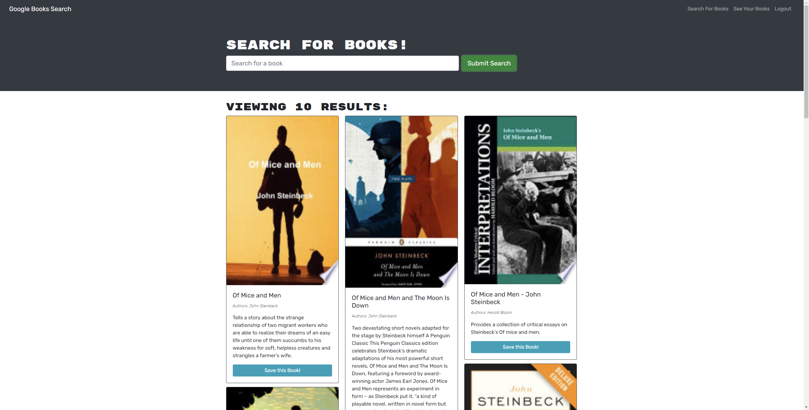

# Book Search

# Description

This is a Google Books API search engine that allows you to search for, and save books.

# Table of Contents

1. [Installation](#installation)
2. [Usage](#usage)
3. [Contribution](#contribution)
4. [Questions](#questions)

# Installation Instructions

You can find the deployed site at the link below:

> [https://thawing-ridge-53409.herokuapp.com/](https://thawing-ridge-53409.herokuapp.com/)

# Usage Info

1. You do not have to be logged in to search for books, however you do need to be logged in to save books.

2. Use the search bar to search for any book(s) you're interested in.

3. When you find a book you're interested in click the save button to save the book to your account.

4. To view your saved books, click the "See Your Books" button in the navigation bar.

# Contribution Guidelines

We are not accepting contributions at this time.

# Questions

GitHub Username: [MarkGranade](https://github.com/MarkGranade)

Email: <mark.granade@gmail.com>
